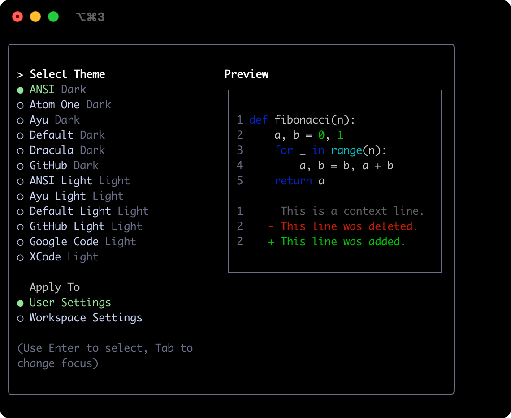
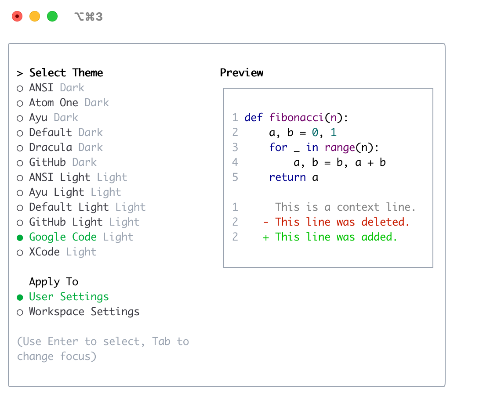

# テーマ

Gemini CLI は、その配色と外観をカスタマイズするためのさまざまなテーマをサポートしています。`/theme` コマンドまたは `"theme":` 構成設定を介して、好みに合わせてテーマを変更できます。

## 利用可能なテーマ

Gemini CLI には、事前に定義されたテーマのセレクションが付属しており、Gemini CLI 内の `/theme` コマンドを使用して一覧表示できます。

- **ダークテーマ:**
  - `ANSI`
  - `Atom One`
  - `Ayu`
  - `Default`
  - `Dracula`
  - `GitHub`
- **ライトテーマ:**
  - `ANSI Light`
  - `Ayu Light`
  - `Default Light`
  - `GitHub Light`
  - `Google Code`
  - `Xcode`

### テーマの変更

1.  Gemini CLI に `/theme` と入力します。
2.  利用可能なテーマを一覧表示するダイアログまたは選択プロンプトが表示されます。
3.  矢印キーを使用してテーマを選択します。一部のインターフェイスでは、選択時にライブプレビューまたはハイライトが表示される場合があります。
4.  選択を確認してテーマを適用します。

### テーマの永続性

選択したテーマは Gemini CLI の [構成](./docs/cli/configuration.md) に保存されるため、セッション間で好みが記憶されます。

## ダークテーマ

### ANSI

### Atom OneDark

### Ayu

### デフォルト

### Dracula

### GitHub

## ライトテーマ

### ANSI ライト

### Ayu ライト

### デフォルトライト

### GitHub ライト

### Google Code

### Xcode

